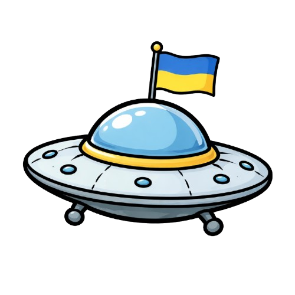

# Домашня робота №5 

## Опис проєкту

Space Invaders — це класична аркадна гра, розроблена як одиничний HTML файл. Гравець керує космічним кораблем у нижній частині екрану і захищає Землю від загону іноземних ворогів, які рухаються формацією та поступово спускаються вниз. Гра включає систему життів, підрахунок очок та збереження найвищого результату.

## Як запустити гру

1. Відкрийте файл `space-invaders.html` у будь-якому сучасному веб-браузері (Chrome, Firefox, Safari, Edge)
2. Гра автоматично завантажиться та буде готова до гри
3. Натисніть SPACE щоб розпочати гру

**Керування:**
- **A / Ліва стрілка** — рух вліво
- **D / Права стрілка** — рух вправо
- **Пробіл** — стрільба
- **Enter** — перезавантаження гри після програшу

## Використаний AI Agent

Проєкт був розроблений за допомогою **GitHub Copilot** (модель визначалася авто), який надавав допомогу в написанні коду, налагодженні логіки гри та оптимізації функціональності.

## Процес створення

Гра була створена з використанням **vibe coding** підходу. Процес включав:

1. **Налаштування VS Code** — підключення та налаштування ШІ агента, встановлення context7  
2. **Налаштування теки проєкту** — створення папки, створення файлу AGENTS.md  
3. **Розробка додатку строго за ТЗ** — створення гри за допомогою ШІ агента строго відповідно до інструкцій файлу AGENTS.md  
4. **Робота з GIT та GITHUB** — створення локального та віддаленого репозиторія, перший коміт  
5. **Покращення** — додаткові налаштування коду та гри  
6. **Остаточне тестування** — кінцеве тестування для перевірки коректності роботи всіх функцій та відображення графіки  
7. **Написання README.MD** — написання файлу README.md відповідно до вимог завдання  

## Покращення та модифікації

👽 **Основні зміни від класичної версії:**

- **Змінена швидкість героя та ворогів** — оптимізовано значення швидкості для комфортного геймплею
- **Змінена графіка героя та ворогів** — оновлено дизайн кораблів та інопланетян для більш привабливого вигляду
- **Додан космонавт** — персонаж з'являється в меню запуску, при програші та перемозі гри
- **Українська мова** — весь текст перекладено на українську мову (меню, текст програшу, перемоги, інструкції)
- **Генеровані зображення** — всі графічні елементи (космонавт, дизайн кораблів та ворогів) були створені за допомогою **Chat GPT**

## Дякую за перевірку!

---

~~Якщо Вам як і мені складно грати в подібні ігри, закоментуйте 785 рядок, щоб кількість життів не зменшувалася :)~~
